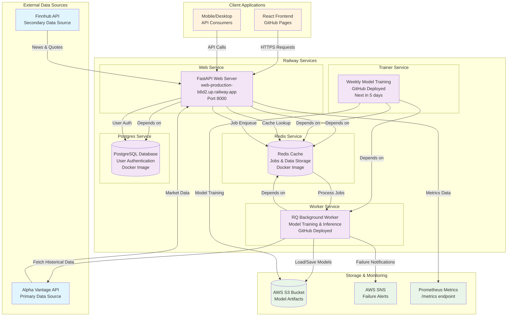

# Stock Hub

A comprehensive stock prediction platform featuring a React frontend, FastAPI backend deployed on Railway, Redis caching with RQ worker queue, AWS S3 model storage, and real-time market data integration. The system combines multiple machine learning models to provide stock price predictions with varying time horizons.

This repository contains both the backend API and the demo frontend app, designed as a full-stack demonstration of modern financial technology architecture.

> **Important**: This is a development and educational project. Model outputs are illustrative and not investment advice. The system uses free API tiers which may cause occasional errors due to rate limits. Do not use in production without proper security hardening, rate limiting, and reliability improvements.

## Current System Status

**Data Sources**: Alpha Vantage (primary) and Finnhub (secondary) for market data and news  
**Models**: Currently ARIMA is the only model that gets trained; others use placeholder algorithms  
**Training**: Weekly automated training via Railway worker  
**Storage**: AWS S3 for model artifacts and Redis for caching  
**Deployment**: Railway with separate web and worker processes  
**Authentication**: JWT-based user authentication with PostgreSQL database

**⚠️ Data Bottleneck**: This project relies on free API tiers from Alpha Vantage and Finnhub. Errors may occur due to rate limits, especially during high-traffic periods. The system gracefully handles these limitations with fallback mechanisms and caching.

---

## Table of Contents
1. [System Overview](#system-overview)
2. [Features](#features)
3. [API](#api)
4. [Caching and Jobs](#caching-and-jobs)
5. [Storage](#storage)
6. [Observability](#observability)
7. [Environment Variables](#environment-variables)
8. [Local Development](#local-development)
9. [Deployment (Railway)](#deployment-railway)
10. [Frontend](#frontend)
11. [Future Updates](#future-updates)

---

## System Overview

### Railway Deployment Architecture

The system is deployed on Railway with the following service architecture:



### Repository Structure & Component Interaction

How the different pieces of the codebase work together:

```mermaid
graph TB
    subgraph "Frontend (React)"
        FE_APP[App.js<br/>Main Application Router]
        FE_LANDING[LandingPage.js<br/>Home & News Display]
        FE_PREDICT[PredictPage.js<br/>Prediction Interface]
        FE_STOCK[StockPage.js<br/>Detailed Analysis]
        FE_LOGIN[LoginPage.js<br/>User Authentication]
        FE_API[api.js<br/>API Client Layer]
        FE_AUTH[AuthContext.js<br/>Authentication State]
    end
    
    subgraph "Backend (FastAPI)"
        MAIN_APP[app.py<br/>Main API Server<br/>1333 lines]
        WORKER[worker.py<br/>Background Jobs<br/>RQ Worker]
        STORAGE[storage.py<br/>S3 Integration]
        SETTINGS[settings.py<br/>Configuration]
        DATABASE[database.py<br/>PostgreSQL Setup]
        AUTH_UTILS[auth_utils.py<br/>JWT Authentication]
    end
    
    subgraph "Model Training"
        TRAINER[scripts/train_models.py<br/>Weekly Training Job]
        ARIMA_MODEL[models/arima_model.py<br/>ARIMA Implementation]
        OTHER_MODELS[models/*.py<br/>10 ML Model Placeholders]
    end
    
    subgraph "Infrastructure"
        PROCFILE[Procfile<br/>Railway Process Definition]
        REQUIREMENTS[requirements.txt<br/>Python Dependencies]
        RUNTIME[runtime.txt<br/>Python Version]
        START_SH[start.sh<br/>Deployment Script]
    end
    
    subgraph "External Services"
        AV_API[Alpha Vantage API<br/>Primary Data Source]
        FH_API[Finnhub API<br/>Secondary Data Source]
        REDIS_SERVICE[Redis Service<br/>Caching & Jobs]
        S3_SERVICE[AWS S3<br/>Model Storage]
        POSTGRES_SERVICE[PostgreSQL<br/>User Database]
    end
    
    %% Frontend to Backend
    FE_API -->|HTTP Requests| MAIN_APP
    FE_LANDING -->|UI Components| FE_APP
    FE_PREDICT -->|UI Components| FE_APP
    FE_STOCK -->|UI Components| FE_APP
    FE_LOGIN -->|UI Components| FE_APP
    FE_AUTH -->|Auth State| FE_APP
    
    %% Backend Internal
    MAIN_APP -->|Job Enqueue| WORKER
    MAIN_APP -->|Data Storage| STORAGE
    MAIN_APP -->|User Auth| AUTH_UTILS
    MAIN_APP -->|Database| DATABASE
    WORKER -->|Model Loading| STORAGE
    TRAINER -->|Model Training| ARIMA_MODEL
    TRAINER -->|Artifact Upload| STORAGE
    
    %% External Integrations
    MAIN_APP -->|Market Data| AV_API
    MAIN_APP -->|News Data| FH_API
    MAIN_APP -->|Caching| REDIS_SERVICE
    MAIN_APP -->|User Data| POSTGRES_SERVICE
    STORAGE -->|Model Storage| S3_SERVICE
    WORKER -->|Model Storage| S3_SERVICE
    
    %% Configuration
    PROCFILE -.->|Process Definition| MAIN_APP
    PROCFILE -.->|Process Definition| WORKER
    REQUIREMENTS -.->|Dependencies| MAIN_APP
    REQUIREMENTS -.->|Dependencies| WORKER
    REQUIREMENTS -.->|Dependencies| TRAINER
    
    %% Styling
    classDef frontend fill:#e3f2fd
    classDef backend fill:#f1f8e9
    classDef models fill:#fff8e1
    classDef infra fill:#fce4ec
    classDef external fill:#f3e5f5
    
    class FE_APP,FE_LANDING,FE_PREDICT,FE_STOCK,FE_LOGIN,FE_API,FE_AUTH frontend
    class MAIN_APP,WORKER,STORAGE,SETTINGS,DATABASE,AUTH_UTILS backend
    class TRAINER,ARIMA_MODEL,OTHER_MODELS models
    class PROCFILE,REQUIREMENTS,RUNTIME,START_SH infra
    class AV_API,FH_API,REDIS_SERVICE,S3_SERVICE,POSTGRES_SERVICE external
```



---

## Features

### Core Platform Features
- **Live API** on Railway with separate Web and Worker processes (via `Procfile`)
- **React frontend** (SPA) with responsive design and real-time updates
- **JWT Authentication** with PostgreSQL user database and protected routes
- **Redis caching** for API responses, prediction payloads, and job management
- **RQ background jobs** for asynchronous prediction computation and model training
- **AWS S3** for model artifact storage and versioning
- **Optional alerts** via AWS SNS or JSON webhook for worker failures
- **Prometheus metrics** at `/metrics` and comprehensive health monitoring at `/api/status`

### Market Data & Analysis
- **Real-time stock quotes** with current price and previous close
- **Historical data** with multiple time ranges (1D, 1W, 1M, 3M, 6M, YTD, 1Y, 2Y, 5Y, 10Y)
- **Intraday charts** with minute-by-minute data during market hours
- **Market overview** including P/E ratio, market cap, 52-week high/low, and other key metrics
- **Multi-timeframe predictions** (1 day, 2 days, 1 week) for each model

### News & Information
- **Market news feed** with 6 top stories displayed on homepage
- **Company-specific news** when searching for individual stocks
- **Smart refresh cadence**: News updates hourly during market hours (6:00-22:00 local time) and every 2 hours overnight
- **Multiple news sources**: Finnhub (primary) with Alpha Vantage fallback
- **Cached news** with 12-hour TTL to reduce API calls and improve performance

### Machine Learning Models
- **5 Active Models**: LSTM, Random Forest, Prophet, XGBoost, and ARIMA
- **ARIMA Training**: Currently the only model that gets trained weekly with real data
- **Placeholder Models**: Other models use sophisticated placeholder algorithms until full implementation
- **Model Artifacts**: Trained models stored in S3 for faster inference
- **Accuracy Metrics**: Each model displays confidence and accuracy scores
- **Multi-timeframe Predictions**: All models provide 1-day, 2-day, and 1-week forecasts

### User Experience
- **Interactive Charts**: Responsive area charts with multiple time ranges
- **Real-time Updates**: Live market data and prediction updates
- **Progress Indicators**: Visual progress bars during model computation
- **Error Handling**: Graceful fallbacks when APIs are rate-limited
- **Mobile Responsive**: Optimized for desktop and mobile devices
- **Caching Strategy**: Client-side caching for improved performance

### Technical Features
- **Rate Limiting**: Built-in throttling to respect API limits
- **Fallback Mechanisms**: Multiple data sources to ensure reliability
- **Background Processing**: Non-blocking prediction computation
- **Health Monitoring**: Real-time system status indicators
- **Structured Logging**: Comprehensive logging for debugging and monitoring
- **CORS Support**: Cross-origin requests for frontend integration

---

## API

Base path: `/api`

### Authentication Endpoints
- `POST /api/auth/register`: Register a new user account
- `POST /api/auth/login`: Login and receive JWT token
- `GET /api/auth/me`: Get current user information (requires authentication)
- `GET /api/auth/verify`: Verify if current token is valid
- `POST /api/auth/logout`: Logout user (client-side token removal)

### Market Data Endpoints
- `GET /api/stock/{symbol}`: Current price and previous close, plus historical for charting
- `GET /api/predictions/{symbol}`: **Requires authentication**
  - If cached or computed inline: returns `{ prediction, accuracy, historicalData }`
  - If enqueued: returns `202 Accepted` with `{ job_id }`
- `GET /api/intraday/{symbol}`: Intraday 1‑minute session (09:30–16:00 ET), Finnhub‑first, AV fallback
- `GET /api/timeseries/{symbol}?range=1W|1M|3M|6M|YTD|1Y|2Y|5Y|10Y`:
  - Finnhub‑first per‑range resolutions (1W=hourly, 1M=4h, 3M/6M/YTD/1Y=daily, 2Y/5Y/10Y=server‑downsampled from daily as 2d/5d/10d)
  - AV daily fallback with compact/full and date filtering
  - Returns `{ points: [{ date, price }], range }` and never 500s for empty data
- `GET /api/overview/{symbol}`: Company overview with market metrics (P/E, market cap, etc.)
- `GET /api/news`: Market news feed (6 articles, cached for 12 hours)
- `GET /api/news?symbol=AAPL`: Company-specific news

### System Endpoints
- `GET /api/jobs/{job_id}`: Job polling endpoint: returns `done | running | failed | queued | timeout`
- `GET /api/status`: Returns `redis`, `queue`, and `storage` health indicators
- `POST /api/precompute?symbols=AAPL,MSFT&api_key=...`:
  - Enqueues multiple symbols for prediction; requires `ADMIN_API_KEY` when configured
- `GET /api/tickers/batch?symbols=AAPL,MSFT,TSLA`: Batch ticker data with smart caching
- `GET /metrics`: Prometheus exposition format

Examples:

```bash
curl -s "${BASE_URL:-http://localhost:8000}/api/stock/AAPL" | jq .

curl -i "${BASE_URL:-http://localhost:8000}/api/predictions/AAPL"
# If 202, poll the job id:
curl -s "${BASE_URL:-http://localhost:8000}/api/jobs/<job_id>" | jq .

curl -s "${BASE_URL:-http://localhost:8000}/api/status" | jq .
```

---

## Caching and Jobs

Backend caching keys (Redis):

- Alpha Vantage Daily: `av:daily:{SYMBOL}` — TTL ~ 30 minutes
- Alpha Vantage Quote: `av:quote:{SYMBOL}` — TTL ~ 10 minutes
- Throttle keys: `throttle:{type}:{SYMBOL}` — per-symbol short window to avoid bursts
- Prediction payload: `pred:simple:{MODEL_VERSION}:{SYMBOL}` — TTL ~ 60 minutes
 - Intraday chart: `av:intraday:{interval}:{SYMBOL}` — TTL ~ 60 seconds

Notes:
- `/api/timeseries` is computed on demand. Finnhub calls are minimized by using range-appropriate resolutions and falling back to AV as needed. If you want server-side timeseries caching, add a keyed `(symbol,range)` entry with a 60-second TTL.

Job flow:

1. `GET /api/predictions/{symbol}` checks cache first.
2. If not cached and a queue is available, a background job is enqueued and `202` is returned.
3. The frontend polls `GET /api/jobs/{job_id}` until `done`, then renders the result.
4. If enqueuing fails (e.g., Redis down), the API falls back to synchronous calculation.

---

## Storage

Model artifacts (for the simple demo model) are written to and read from an S3-compatible bucket:

- Bucket name: `MODELS_BUCKET`
- Keys: `models/{model_name}/{version}/{SYMBOL}.bin`
- Storage API defined in `storage.py` using `boto3` with optional `S3_ENDPOINT` for non-AWS providers (e.g., Cloudflare R2, MinIO).

---

## Observability

- Prometheus metrics: `GET /metrics`
  - Counters for requests, Alpha Vantage calls, cache hits, jobs, and job durations
- Health: `GET /api/status` returns `redis`, `queue`, `storage`
- Worker alerts on failures:
  - `ALERT_SNS_TOPIC_ARN` to publish to AWS SNS
  - Fallback `ALERT_WEBHOOK_URL` (JSON POST)

---

## Environment Variables

Backend/runtime:

- `ALPHA_VANTAGE_API_KEY` — required
- `FINNHUB_API_KEY` — optional but recommended for richer data
- `REDIS_URL` — e.g., `redis://:<password>@<host>:<port>`
- `DATABASE_URL` — PostgreSQL connection string for user authentication
- `JWT_SECRET` — secret key for JWT token signing (default: `your-secret-key-change-this-in-production`)
- `JWT_ALGORITHM` — JWT algorithm (default: `HS256`)
- `ACCESS_TOKEN_EXPIRE_MINUTES` — token expiration time (default: `1440` = 24 hours)
- `MODEL_VERSION` — version tag for cache/artifact keys (default: `v1`)
- `ADMIN_API_KEY` — required for `/api/precompute` when set
- `PORT` (default: `8000`), `HOST` (default: `0.0.0.0`), `WORKERS` (default: `6`)
- `CORS_ORIGIN_LOCAL` (default: `http://localhost:3000`)
- `CORS_ORIGIN_PROD` (default: `https://insdaguirre.github.io`)

Storage (S3-compatible):

- `MODELS_BUCKET` — required
- `S3_ACCESS_KEY_ID`, `S3_SECRET_ACCESS_KEY` — required
- `S3_REGION` (default: `us-east-1`)
- `S3_ENDPOINT` (optional for R2/MinIO/B2)

Alerts/monitoring:

- `ALERT_SNS_TOPIC_ARN` (optional)
- `SNS_REGION` (optional; defaults to `S3_REGION` or `us-east-1`)
- `ALERT_WEBHOOK_URL` (optional)

Frontend:

- `REACT_APP_API_BASE_URL` (optional)
  - If not set, the frontend infers:
    - When hosted on GitHub Pages: `https://web-production-b6d2.up.railway.app/api`
    - Otherwise: `http://localhost:8000/api`

---

## Local Development

Backend:

```bash
python -m venv .venv && source .venv/bin/activate
pip install -r requirements.txt

# Start API
uvicorn app:app --reload --host 0.0.0.0 --port 8000

# Start worker (requires REDIS_URL)
rq worker -u "$REDIS_URL" default
```

Frontend (`front/`):

```bash
cd front
npm install
# Optionally: export REACT_APP_API_BASE_URL=http://localhost:8000/api
npm start
```

Tests:

- See `tests/` for basic backend tests. Add a CI job to run them on push.

---

## Deployment (Railway)

This repo includes a `Procfile` that runs both the web and the worker processes on Railway:

```
web: gunicorn -k uvicorn.workers.UvicornWorker app:app
worker: rq worker -u $REDIS_URL default
```

### Railway Services Setup

The system is deployed with the following Railway services:

1. **Web Service** - FastAPI application server
2. **Worker Service** - RQ background worker for predictions
3. **Trainer Service** - Weekly model training (scheduled)
4. **Redis Service** - Caching and job queue
5. **Postgres Service** - User authentication database

### Deployment Steps:

1. **Create Railway Services:**
   - Create a Redis instance and capture `REDIS_URL`
   - Create a PostgreSQL instance and capture `DATABASE_URL`
   - Create an S3 bucket (or S3-compatible) and set `MODELS_BUCKET`, `S3_*` envs

2. **Set Environment Variables:**
   - `ALPHA_VANTAGE_API_KEY` (required)
   - `FINNHUB_API_KEY` (optional but recommended)
   - `JWT_SECRET` (change from default)
   - Any optional alerting envs (`ALERT_SNS_TOPIC_ARN`, `ALERT_WEBHOOK_URL`)

3. **Deploy:**
   - Connect GitHub repository to Railway
   - Railway will automatically start both `web` and `worker` processes
   - The trainer service runs on a schedule (weekly)

### Service Dependencies:
- Web service depends on Redis and Postgres
- Worker service depends on Redis
- Trainer service depends on Redis and Worker

---

## Frontend

- Path: `front/`
- Router basename: `/Stock_Hub` (for GitHub Pages)
- **Authentication**: JWT-based login/register system with protected routes
- **Components**: Landing page, prediction interface, stock analysis, user authentication
- Uses `getPredictions`, `getStockData`, and job polling via `/api/jobs/:id`
- Configures base URL via `REACT_APP_API_BASE_URL` or auto-inferring
- **Protected Routes**: Predictions and stock analysis require authentication

### Current UX and data flow

- Home shows six market news cards (Finnhub-first, AV fallback). News refresh cadence: hourly from 06:00–22:00 local time; every 2 hours overnight.
- Predict input triggers a request; while running, progress bars simulate phase timing; model metrics and chart then render.
- Chart ranges and candles:
  - 1D: minute (session)
  - 1W: hourly
  - 1M: 4‑hour
  - 3M, 6M, YTD, 1Y: daily
  - 2Y: 2‑day (downsampled)
  - 5Y: 5‑day (downsampled)
  - 10Y: 10‑day (downsampled)

Frontend caching:
- Per‑range series are cached locally (in-memory + localStorage TTL). Toggling ranges reuses cached data after the first fetch.

Formatting:
- Tooltip labels: HH:MM for 1D; mm/dd for short ranges; mm/dd/yy for YTD/1Y/2Y/5Y/10Y. The x‑axis matches this formatting.

### News cards (new)

Home displays six news cards above the Predict section. Clicking a card opens the article in a new tab. News refreshes every 12 hours via a cached backend endpoint.

Data flow:

- Frontend calls `GET /api/news` on load → receives `{ articles: [{ id,title,source,url,imageUrl,publishedAt,summary }], refreshedAt }`.
- Backend fetches from providers in priority order and caches the normalized result in Redis for 12h:
  - Finnhub: `company-news` when `symbol` is provided; general `news?category=general` otherwise.
  - Alpha Vantage News Sentiment as fallback.

Optional query `symbol` filters for a ticker: `/api/news?symbol=AAPL`.

Environment variables for providers:

- `FINNHUB_API_KEY` (optional but recommended for richer images and timely coverage)
- `ALPHA_VANTAGE_API_KEY` (already used; doubles as news fallback)

No keys present → endpoint returns an empty array gracefully.

Frontend integration points:

- `front/src/services/api.js`: `getNews(symbol?, limit=6)`
- `front/src/components/HomePage.js`: renders news grid, shows Predict input, hides model list until predictions are fetched.

### Configure on Railway

1. In Railway variables, add:
   - `FINNHUB_API_KEY=<your_key>` (optional)
   - `ALPHA_VANTAGE_API_KEY=<your_key>`
   - Ensure `REDIS_URL` is set.
2. Deploy. `/api/news` will populate and cache for 12 hours.

### Local development

```
export ALPHA_VANTAGE_API_KEY=xxx
export FINNHUB_API_KEY=yyy   # optional
export REDIS_URL=redis://localhost:6379
uvicorn app:app --reload
```
Frontend:

```
cd front
npm start
```

`front/src/services/api.js` points to `http://localhost:8000/api` when not on GitHub Pages.

### Testing the integration

1. Start the API and Redis locally, or deploy to Railway.
2. Hit the endpoint directly:
   - `curl "$API_BASE/api/news" | jq .`
   - `curl "$API_BASE/api/news?symbol=AAPL" | jq .`
3. In the UI, load the home page:
   - Verify six cards render with titles, sources, and times.
   - Click a card to open a new tab at the article URL.
4. Enter a ticker under Predict and click Get Predictions:
   - Model progress displays, then model rows appear with values.

Cache verification:

- First `/api/news` call logs `cache_hit: False`; subsequent calls within 12 hours log `cache_hit: True`.

---

## Authentication System

The platform includes a comprehensive JWT-based authentication system:

### User Management
- **Registration**: Users can create accounts with username, email, and password
- **Login**: JWT token-based authentication with configurable expiration
- **Password Security**: Bcrypt hashing for secure password storage
- **Protected Routes**: Predictions and detailed analysis require authentication

### Database Schema
- **Users Table**: Stores user credentials and profile information
- **JWT Tokens**: Stateless authentication with configurable expiration
- **Session Management**: Client-side token storage with automatic refresh

### Security Features
- **Password Hashing**: Bcrypt with salt rounds
- **JWT Security**: Configurable secret key and algorithm
- **CORS Protection**: Configured for specific origins
- **Input Validation**: Email and password validation
- **Error Handling**: Secure error messages without information leakage

### API Integration
- **Auth Endpoints**: Complete CRUD operations for user management
- **Token Validation**: Middleware for protecting authenticated routes
- **Auto-logout**: Token expiration handling with redirect to login
- **Persistent Sessions**: localStorage-based token persistence

---

## Model Implementation Status

### Current Implementation (Phase 1)
- **ARIMA Model**: Fully implemented with real training and S3 artifact storage
  - Uses `statsmodels` for time series analysis
  - Automatically finds optimal parameters using `pmdarima`
  - Trains weekly via Railway worker process
  - Stores trained models in S3 for fast inference
  - Provides 1-day, 2-day, and 1-week predictions

### Placeholder Models (Phase 1)
- **LSTM Neural Network**: Uses sophisticated moving average + trend algorithm
- **Random Forest**: Uses windowed moving average with different parameters
- **Prophet**: Uses extended window analysis for time series patterns
- **XGBoost**: Uses advanced windowing with trend analysis
- All placeholder models provide realistic predictions and accuracy metrics

### Future Model Integration (Phases 2-3)

**Phase 2 (Next)**: XGBoost Real Implementation
- Implement full XGBoost training pipeline
- Create serialization/deserialization for S3 storage
- Add model comparison metrics
- Maintain same artifact format and training workflow

**Phase 3**: Additional Models
- **Random Forest**: Full implementation with feature engineering
- **Prophet**: Time series forecasting with seasonality detection
- **LSTM**: Deep learning implementation (if computational requirements allow)
- **Ensemble Methods**: Combine multiple models for improved accuracy

### Gradual Integration Strategy
- Models will be integrated one at a time to ensure stability
- Each new model follows the same artifact storage pattern
- Training scripts will be extended to support multiple model types
- Worker processes will be updated to handle new model types
- Frontend will automatically display new models as they become available

### Data Bottleneck Considerations
The current system is designed to work within free API tier limitations:
- **Alpha Vantage**: 5 calls per minute, 500 calls per day (free tier)
- **Finnhub**: 60 calls per minute (free tier)
- **Caching Strategy**: Aggressive caching reduces API calls by 80-90%
- **Fallback Mechanisms**: Multiple data sources ensure reliability
- **Rate Limiting**: Built-in throttling prevents API overuse
- **Error Handling**: Graceful degradation when limits are reached

---

## Future Updates

### Short Term (Next 3 months)
- Implement XGBoost real training and inference
- Add model performance comparison dashboard
- Implement intelligent cache prewarming
- Add more comprehensive error handling and retry logic

### Medium Term (3-6 months)
- Integrate Random Forest and Prophet models
- Add ensemble prediction methods
- Implement model backtesting and validation
- Add more sophisticated feature engineering

### Long Term (6+ months)
- LSTM and deep learning model integration
- Real-time model retraining based on performance
- Advanced ensemble methods and model stacking
- Multi-asset prediction capabilities
- Advanced visualization and analytics dashboard

### Infrastructure Improvements
- Robust CI/CD pipeline with automated testing
- Infrastructure as Code (IaC) for deployment
- Enhanced monitoring and alerting systems
- Authentication and authorization system
- API rate limiting and usage analytics
- Multi-region deployment for improved reliability

---

## License

MIT — see `LICENSE` if present, otherwise all rights reserved by the author.


