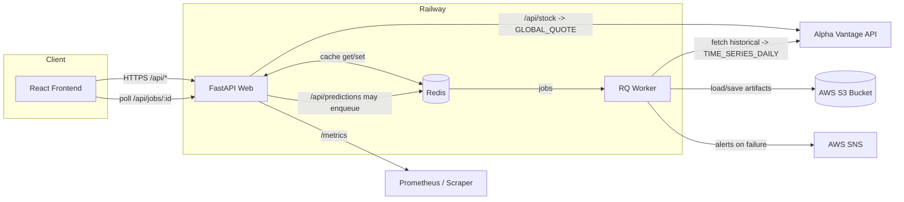

# Stock Hub

End-to-end stock prediction demo with a React frontend, FastAPI backend on Railway, Redis caching + RQ worker queue, AWS S3 model storage, and optional AWS SNS/webhook alerts. Alpha Vantage provides market data. Prometheus metrics are exposed for monitoring.

This repository contains both the backend API and the demo frontend app.

> Development-only: This is a demo build intended for development and educational purposes. Model outputs are illustrative and not investment advice. Do not use in production without hardening security, rate limiting, costs, and reliability.

---

## Table of Contents
1. [System Overview](#system-overview)
2. [Features](#features)
3. [API](#api)
4. [Caching and Jobs](#caching-and-jobs)
5. [Storage](#storage)
6. [Observability](#observability)
7. [Environment Variables](#environment-variables)
8. [Local Development](#local-development)
9. [Deployment (Railway)](#deployment-railway)
10. [Frontend](#frontend)
11. [Future Updates](#future-updates)

---

## System Overview

High-level architecture showing how the frontend, backend, caching, storage, and third-party APIs interact:



---

## Features

- **Live API** on Railway with separate Web and Worker dynos (via `Procfile`)
- **React frontend** (SPA) consuming the API with job polling
- **Redis caching** for Alpha Vantage responses and prediction payloads
- **RQ background jobs** for async prediction computation
- **AWS S3** for simple model artifact storage
- **Optional alerts** via AWS SNS or JSON webhook for worker failures
- **Prometheus metrics** at `/metrics` and service health at `/api/status`

---

## API

Base path: `/api`

- `GET /api/stock/{symbol}`: Current price and previous close, plus historical for charting
- `GET /api/predictions/{symbol}`:
  - If cached or computed inline: returns `{ prediction, accuracy, historicalData }`
  - If enqueued: returns `202 Accepted` with `{ job_id }`
- `GET /api/jobs/{job_id}`: Job polling endpoint: returns `done | running | failed | queued | timeout`
- `GET /api/status`: Returns `redis`, `queue`, and `storage` health indicators
- `POST /api/precompute?symbols=AAPL,MSFT&api_key=...`:
  - Enqueues multiple symbols for prediction; requires `ADMIN_API_KEY` when configured
- `GET /metrics`: Prometheus exposition format

Examples:

```bash
curl -s "${BASE_URL:-http://localhost:8000}/api/stock/AAPL" | jq .

curl -i "${BASE_URL:-http://localhost:8000}/api/predictions/AAPL"
# If 202, poll the job id:
curl -s "${BASE_URL:-http://localhost:8000}/api/jobs/<job_id>" | jq .

curl -s "${BASE_URL:-http://localhost:8000}/api/status" | jq .
```

---

## Caching and Jobs

Backend caching keys (Redis):

- Alpha Vantage Daily: `av:daily:{SYMBOL}` — TTL ~ 30 minutes
- Alpha Vantage Quote: `av:quote:{SYMBOL}` — TTL ~ 10 minutes
- Throttle keys: `throttle:{type}:{SYMBOL}` — per-symbol short window to avoid bursts
- Prediction payload: `pred:simple:{MODEL_VERSION}:{SYMBOL}` — TTL ~ 60 minutes

Job flow:

1. `GET /api/predictions/{symbol}` checks cache first.
2. If not cached and a queue is available, a background job is enqueued and `202` is returned.
3. The frontend polls `GET /api/jobs/{job_id}` until `done`, then renders the result.
4. If enqueuing fails (e.g., Redis down), the API falls back to synchronous calculation.

---

## Storage

Model artifacts (for the simple demo model) are written to and read from an S3-compatible bucket:

- Bucket name: `MODELS_BUCKET`
- Keys: `models/{model_name}/{version}/{SYMBOL}.bin`
- Storage API defined in `storage.py` using `boto3` with optional `S3_ENDPOINT` for non-AWS providers (e.g., Cloudflare R2, MinIO).

---

## Observability

- Prometheus metrics: `GET /metrics`
  - Counters for requests, Alpha Vantage calls, cache hits, jobs, and job durations
- Health: `GET /api/status` returns `redis`, `queue`, `storage`
- Worker alerts on failures:
  - `ALERT_SNS_TOPIC_ARN` to publish to AWS SNS
  - Fallback `ALERT_WEBHOOK_URL` (JSON POST)

---

## Environment Variables

Backend/runtime:

- `ALPHA_VANTAGE_API_KEY` — required
- `REDIS_URL` — e.g., `redis://:<password>@<host>:<port>`
- `MODEL_VERSION` — version tag for cache/artifact keys (default: `v1`)
- `ADMIN_API_KEY` — required for `/api/precompute` when set
- `PORT` (default: `8000`), `HOST` (default: `0.0.0.0`), `WORKERS` (default: `6`)
- `CORS_ORIGIN_LOCAL` (default: `http://localhost:3000`)
- `CORS_ORIGIN_PROD` (default: `https://insdaguirre.github.io`)

Storage (S3-compatible):

- `MODELS_BUCKET` — required
- `S3_ACCESS_KEY_ID`, `S3_SECRET_ACCESS_KEY` — required
- `S3_REGION` (default: `us-east-1`)
- `S3_ENDPOINT` (optional for R2/MinIO/B2)

Alerts/monitoring:

- `ALERT_SNS_TOPIC_ARN` (optional)
- `SNS_REGION` (optional; defaults to `S3_REGION` or `us-east-1`)
- `ALERT_WEBHOOK_URL` (optional)

Frontend:

- `REACT_APP_API_BASE_URL` (optional)
  - If not set, the frontend infers:
    - When hosted on GitHub Pages: `https://web-production-b6d2.up.railway.app/api`
    - Otherwise: `http://localhost:8000/api`

---

## Local Development

Backend:

```bash
python -m venv .venv && source .venv/bin/activate
pip install -r requirements.txt

# Start API
uvicorn app:app --reload --host 0.0.0.0 --port 8000

# Start worker (requires REDIS_URL)
rq worker -u "$REDIS_URL" default
```

Frontend (`front/`):

```bash
cd front
npm install
# Optionally: export REACT_APP_API_BASE_URL=http://localhost:8000/api
npm start
```

Tests:

- See `tests/` for basic backend tests. Add a CI job to run them on push.

---

## Deployment (Railway)

This repo includes a `Procfile` that runs both the web and the worker processes on Railway:

```
web: gunicorn -k uvicorn.workers.UvicornWorker app:app
worker: rq worker -u $REDIS_URL default
```

Steps:

1. Create a Redis instance and capture `REDIS_URL`.
2. Create an S3 bucket (or S3-compatible) and set `MODELS_BUCKET`, `S3_*` envs.
3. Set `ALPHA_VANTAGE_API_KEY` and any optional alerting envs.
4. Deploy the service; Railway will start both `web` and `worker`.

---

## Frontend

- Path: `front/`
- Router basename: `/Stock_Hub` (for GitHub Pages)
- Uses `getPredictions`, `getStockData`, and job polling via `/api/jobs/:id`
- Configures base URL via `REACT_APP_API_BASE_URL` or auto-inferring

---

## Future Updates

- Expand real model training/inference (beyond demo simple predictor) and persist per-symbol artifacts
- Intelligent cache invalidation and prewarming jobs (e.g., daily scheduler)
- Stronger rate limiting and retries around Alpha Vantage usage
- Robust CI/CD (lint, type check, tests, Docker images, preview deploys)
- IaC for infra (Redis, S3, Railway) and secrets management
- AuthN/Z and per-user rate limits; API keys for paid tiers
- Structured logging, tracing, dashboards, and alerts (Grafana/Tempo/Promtail)
- E2E tests for frontend + backend (Playwright/Cypress)
- Multi-model ensemble and backtesting UI

---

## License

MIT — see `LICENSE` if present, otherwise all rights reserved by the author.


